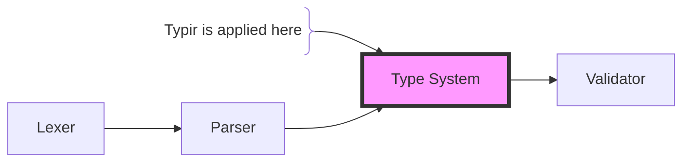
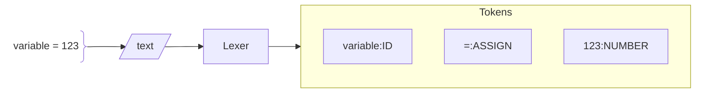
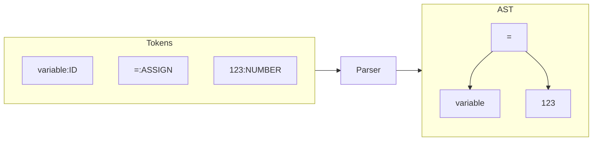
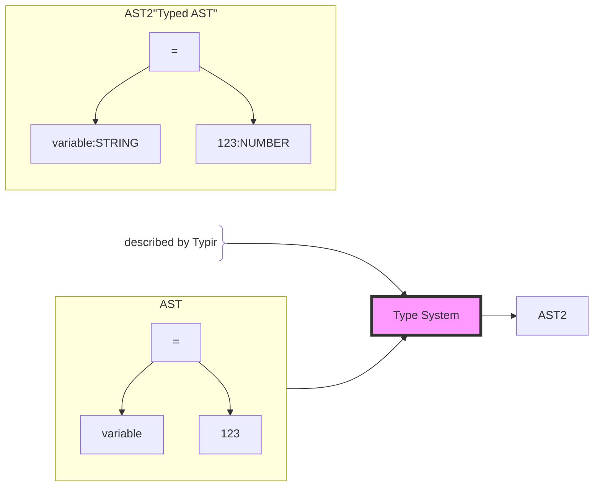
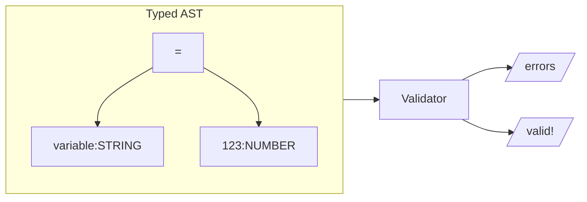

# A handwritten parser

This package contains a handwritten parser for a simple expression language.
The language supports:

- Variables declarations with the types `number` and `string`
- Variable Assignments
- Arithmetic expressions
- Print statements
- Expressions, like basic arithmetic operations, string concatenation, variable references, literals and parentheses

## How does it work?

Parsing is a linear process that takes a string of text and produces a tree-like structure that represents the structure of the text.

The following sections describe each step in the process.

### Lexer

**Input**: A string of text

**Output**: A list of tokens

**Task**: Splits the text to tokens and classifies each token.

### Parser

**Input**: A list of tokens

**Output**: An Abstract Syntax Tree (AST)

**Task**: Takes token and arranges them as a tree.

### Type system

**Input**: An AST

**Output**: A typed AST

**Task**: Assigns types to the nodes of the AST.

### Validator

**Input**: A typed AST

**Output**: a list of errors

**Task**: Checks if the AST is valid.

